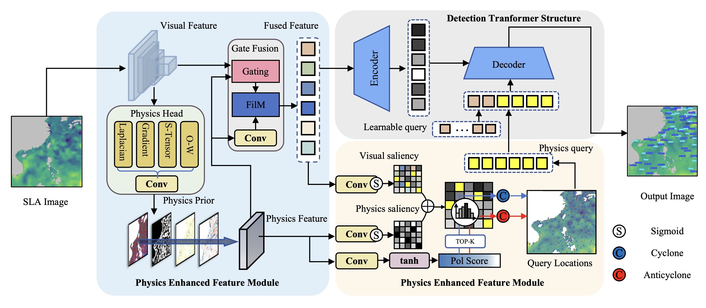

# PE-DETR: A Physics-Enhanced Detection Transformer for Mesoscale Eddy Detection

This is the implementation of the paper: **PE-DETR: A Physics-Enhanced Detection Transformer for Mesoscale Eddy Detection**

> ⚠ **Note:** The source code is currently incomplete and will be fully released once the manuscript is accepted by the journal.


## Datasets
Experiments on **manually annotated mesoscale eddy dataset**

## Model Framework


## Environment
```bash
# Python 3.7+, PyTorch 1.9+, CUDA 11.1+
pip install -r requirements.txt
```

## Installation

1. Clone this repository
```bash
git clone https://github.com/your-repo/PE-DETR
cd PE-DETR
```

2. Install dependencies
```bash
pip install -r requirements.txt
```

3. Compile CUDA operators
```bash
cd models/dino/ops
python setup.py build install
python test.py  # Verify installation
cd ../../..
```

## Training/Resume Training

### Single GPU Training
```bash
python main.py \
    -c config/PEDETR_eddy.py \
    --coco_path /path/to/eddy_dataset \
    --use_physics \
    --use_phys_query_init \
    --use_ms_physics
```

### Multi-GPU Training
```bash
python -m torch.distributed.launch --nproc_per_node=8 main.py \
    -c config/PEDETR_eddy.py \
    --coco_path /path/to/eddy_dataset \
    --use_physics \
    --use_phys_query_init \
    --use_ms_physics
```


## Acknowledgment

Our work is based on the following project:

- [Lite-DETR](https://github.com/IDEA-Research/Lite-DETR)

We also benefited a lot from the following projects:

- [DETR](https://github.com/facebookresearch/detr)
- [Deformable DETR](https://github.com/fundamentalvision/Deformable-DETR)

## 📬 Contact

Feel free to contact us if you have any questions:
- Author: [wangyunqi@stu.ouc.edu.cn](mailto:wangyunqi@stu.ouc.edu.cn)
- Institution: Ocean University of China

---
 